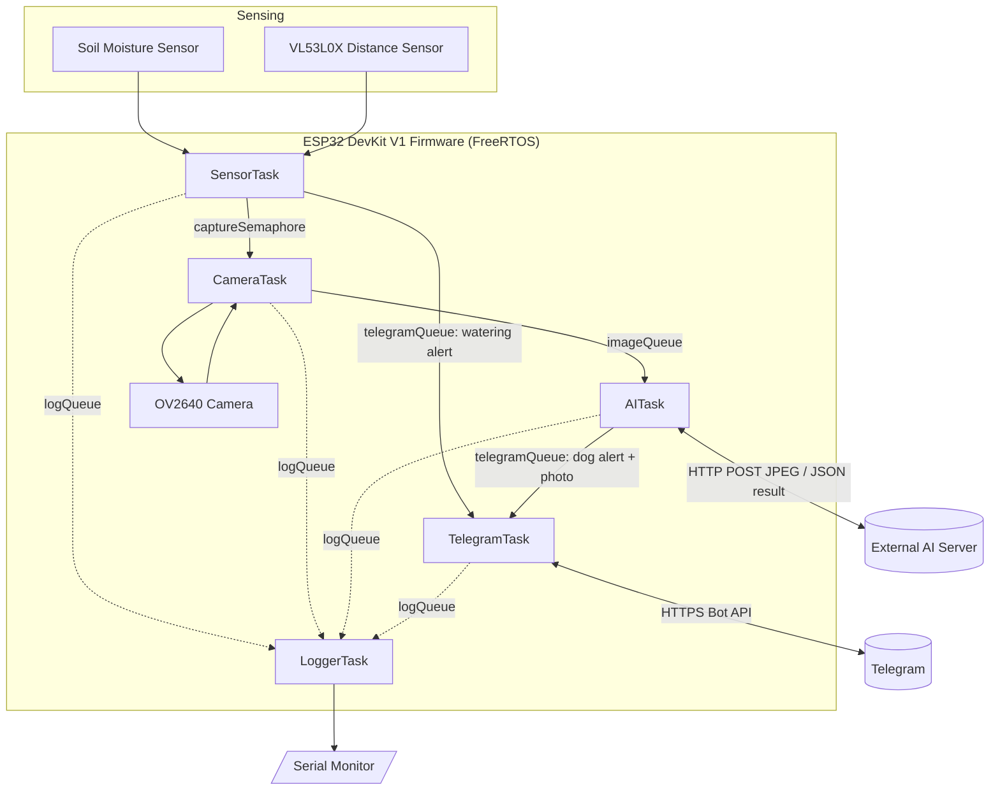

# 🪴 Smart Plant Guardian

A FreeRTOS-based ESP32 firmware that watches over a single potted garden
plant: it tracks soil moisture and alerts you when it's time to water, and
it watches for dogs sniffing around the pot using a distance sensor, a
camera, and an external AI classification server — all over Telegram.

Built as a portfolio piece to demonstrate production-style embedded
firmware: independent FreeRTOS tasks, queue/semaphore/event-group based
communication, non-blocking I/O throughout, layered error handling, and a
small native unit-test suite for the hardware-independent logic.

## Table of contents

- [Features](#features)
- [Architecture](#architecture)
- [Tasks and IPC primitives](#tasks-and-ipc-primitives)
- [Hardware](#hardware)
- [Design decisions](#design-decisions)
- [Repository structure](#repository-structure)
- [Getting started](#getting-started)
- [Configuration reference](#configuration-reference)
- [Telegram bot setup](#telegram-bot-setup)
- [AI server API contract](#ai-server-api-contract)
- [Error handling](#error-handling)
- [Serial log examples](#serial-log-examples)
- [Unit tests](#unit-tests)
- [Future improvements](#future-improvements)

## Features

### 1. Soil moisture monitoring
- Reads the capacitive soil sensor every 10 seconds (`Config::SOIL_READ_INTERVAL_MS`).
- Converts the raw ADC value to a 0-100% moisture reading against
  calibrated dry/wet endpoints.
- Sends a Telegram alert the instant moisture drops to/below a configurable
  threshold (`Config::SOIL_MOISTURE_THRESHOLD_PERCENT`, default 35%) —
  **edge-triggered**, so it fires once, not on every 10s cycle, until
  moisture recovers above the threshold and the alert re-arms.

### 2. Dog detection near the plant
- VL53L0X continuously measures distance (10 Hz).
- An object sustained closer than 50 cm (`Config::DISTANCE_THRESHOLD_MM`)
  for at least 1 second (`Config::DISTANCE_SUSTAIN_MS`) triggers a capture.
- The captured JPEG is POSTed to an external AI server; a response of
  `{"object":"dog","confidence":>0.9}` sends a Telegram alert with the
  photo attached. Humans, cats, and low-confidence/unknown results are
  silently ignored. A cooldown window prevents a lingering animal from
  spamming repeated captures.

## Architecture



## Tasks and IPC primitives

### Tasks

| Task           | Priority | Stack  | Core | Responsibility |
|----------------|:--------:|:------:|:----:|-----------------|
| `LoggerTask`   | 1        | 3072   | any  | Sole owner of `Serial`; drains `logQueue` and prints timestamped, leveled log lines. |
| `SensorTask`   | 2        | 4096   | any  | Polls VL53L0X every 100 ms and runs the sustained-proximity state machine; reads soil moisture every 10 s and runs the watering-alert edge trigger. |
| `CameraTask`   | 3        | 8192   | 1    | Blocks on `captureSemaphore`; on wake, captures one JPEG and hands it to `AITask`. Highest priority + pinned to core 1 so a capture isn't delayed behind WiFi/BT housekeeping on core 0. |
| `AITask`       | 2        | 6144   | any  | Uploads the JPEG to the AI server, applies the `object == "dog" && confidence > 0.9` rule, forwards a Telegram alert (with photo) only on a match. Owns and frees the image buffer otherwise. |
| `TelegramTask` | 2        | 12288  | any  | Sole consumer of `telegramQueue`; sends text or photo messages via the Bot API. Largest stack because `WiFiClientSecure`'s TLS handshake is the most stack-hungry operation in the firmware. |

Every task follows the same non-blocking idle pattern: block on its queue/semaphore
with a **bounded** timeout (never `portMAX_DELAY`), so it wakes up periodically
even while idle purely to feed the software watchdog
(`esp_task_wdt_reset()`). Nothing in the firmware calls `delay()`; all
timing uses `vTaskDelay`/`vTaskDelayUntil`, queue/semaphore timeouts, or
plain `millis()` comparisons for sub-tick scheduling (e.g. the 10-second
moisture cadence inside `SensorTask`'s faster 100 ms loop).

### Queues, semaphore, and event group

| Primitive | Kind | Depth | Producer → Consumer | Payload | Why this primitive |
|---|---|:--:|---|---|---|
| `logQueue` | Queue | 16 | *any task* → `LoggerTask` | `LogMessage` (level + text) | Many-to-one fan-in avoids a Serial mutex: `LoggerTask` is the only task that ever touches `Serial`. |
| `imageQueue` | Queue | 2 | `CameraTask` → `AITask` | `CameraCaptureResult` (heap pointer + length) | Only a pointer/length crosses the queue, not the image bytes themselves — cheap to copy, and ownership of the heap buffer transfers with it. |
| `telegramQueue` | Queue | 4 | `SensorTask`, `AITask` → `TelegramTask` | `TelegramMessage` (text + optional image pointer) | Single fan-in point for every outbound notification, so `TelegramTask` is the only task that talks to the Bot API. |
| `captureSemaphore` | Binary semaphore | — | `SensorTask` → `CameraTask` | none (pure event) | No data needs to travel, just a wake-up edge the instant the distance state machine confirms a sustained close-range object — a semaphore is the minimal-overhead primitive for that. |
| `systemEvents` (`WIFI_CONNECTED_BIT`) | Event group | — | WiFi event callback → `AITask`, `TelegramTask`, `SensorTask` | 1 bit | Lets network-dependent tasks check/skip instead of blocking on a dead socket; set/cleared asynchronously from the WiFi stack's own event callback, not polled. |

Deliberately **not** used: no raw global variables carry sensor state or
buffers between tasks — the RTOS handles above (declared once in
`rtos_resources.h`, defined once in `rtos_resources.cpp`) are the only
cross-task globals in the codebase.

## Hardware

| Component | Role |
|---|---|
| ESP32 DevKit V1 | Single main controller — runs the entire FreeRTOS application, including the camera driver |
| OV2640 camera module | Image capture for AI classification |
| VL53L0X (ToF) | Distance sensor for dog-proximity detection |
| Capacitive Soil Moisture Sensor v2.0 | Analog soil moisture input |
| WiFi (built-in) | Telegram Bot API + AI server connectivity |

Full pin-by-pin wiring, a block diagram, and the reasoning behind every
GPIO choice live in **[docs/wiring_diagram.md](docs/wiring_diagram.md)**.

## Design decisions

**Single-board, not ESP32-CAM + separate main controller.** The brief lists
an ESP32 DevKit V1 as "main controller" and an ESP32-CAM as "camera"
separately, but the task architecture (one set of FreeRTOS tasks, one
`imageQueue` handoff from capture to inference) is a single-firmware
design. Physically splitting it would require a second microcontroller and
an inter-board transport (UART/ESP-NOW/HTTP) that the spec never
describes. Instead, this project wires an OV2640 camera module directly to
a DevKit V1 (a well-supported configuration — the AI-Thinker ESP32-CAM
uses the exact same OV2640 + esp32-camera driver, just on different GPIOs)
so the whole system is one firmware image on one board. See
`docs/wiring_diagram.md` for the resulting pin plan and why it avoids the
ADC2/WiFi conflict and GPIO contention the AI-Thinker board's fixed pinout
would otherwise create with the other two sensors. If a genuine two-board
deployment is needed, the natural seam is `CameraTask`: replace its direct
`CameraManager::capture()` call with an HTTP request to a second board
running just the camera + a tiny capture-on-demand HTTP endpoint.

**No PSRAM assumed.** A plain DevKit V1 has no PSRAM, so the camera is
configured for VGA/JPEG with a single frame buffer in internal DRAM
(`src/camera.cpp`). If you wire this to a PSRAM-equipped board (e.g. an
ESP32-WROVER dev board), raising `frame_size`/`fb_count`/`fb_location` in
`CameraManager::init()` is a one-line-per-field change.

**Retries, not silent failure.** Every network call (AI upload, Telegram
send) retries a configurable number of times with a fixed backoff via
`vTaskDelay` before giving up and logging an error — see
[Error handling](#error-handling).

**Software watchdog.** Every task calls `esp_task_wdt_add(NULL)` on start
and `esp_task_wdt_reset()` on every loop iteration, including idle
iterations (each task's blocking wait uses a bounded timeout specifically
so this stays true even when nothing is happening). A genuinely wedged
task (e.g. stuck in a blocking call) trips the watchdog and reboots the
device rather than hanging forever un-noticed.

**State machines.** `DetectionLogic::DistanceStateMachine`
(`include/detection_logic.h`) turns a noisy stream of proximity samples
into a single clean `TRIGGER` edge with `IDLE → CANDIDATE → COOLDOWN`
states, and is unit-tested in isolation (see [Unit tests](#unit-tests)).

**Unit-testable core logic.** ADC→percentage conversion and the
dog-detection/state-machine rules live in plain C++ modules with zero
Arduino/ESP-IDF dependencies (`moisture_utils.*`, `detection_logic.h`), so
they can be exercised on a desktop with PlatformIO's `native` platform —
no board, no mocks.

## Repository structure

```
.
├── platformio.ini
├── include/
│   ├── config.h            # all tunables/secrets in one place
│   ├── types.h              # queue/message payload structs
│   ├── logging.h            # Logger::log() + LOG_* macros
│   ├── rtos_resources.h     # queue/semaphore/event-group declarations
│   ├── wifi.h                # WiFiManager
│   ├── camera.h              # CameraManager
│   ├── ai_client.h           # AIClient
│   ├── telegram.h            # TelegramClient
│   ├── moisture_utils.h      # pure ADC->% logic (unit-tested)
│   ├── detection_logic.h     # pure state machine + dog rule (unit-tested)
│   └── tasks/
│       ├── SensorTask.h
│       ├── CameraTask.h
│       ├── AITask.h
│       ├── TelegramTask.h
│       └── LoggerTask.h
├── src/
│   ├── main.cpp
│   ├── rtos_resources.cpp
│   ├── wifi.cpp
│   ├── camera.cpp
│   ├── ai_client.cpp
│   ├── telegram.cpp
│   ├── moisture_utils.cpp
│   └── tasks/
│       ├── SensorTask.cpp
│       ├── CameraTask.cpp
│       ├── AITask.cpp
│       ├── TelegramTask.cpp
│       └── LoggerTask.cpp
├── test/
│   └── test_logic/
│       └── test_logic.cpp   # native Unity tests, no hardware required
└── docs/
    └── wiring_diagram.md
```

## Getting started

### Prerequisites
- [PlatformIO](https://platformio.org/) (VS Code extension or `pio` CLI)
- A Telegram bot token and chat ID (see [Telegram bot setup](#telegram-bot-setup))
- A reachable HTTP endpoint implementing the [AI server API contract](#ai-server-api-contract)

### Build & flash

```sh
git clone <this-repo-url> smart-plant-guardian
cd smart-plant-guardian

# Fill in WiFi/Telegram/AI credentials — see Configuration reference below
$EDITOR include/config.h

pio run -e esp32dev -t upload
pio device monitor -e esp32dev
```

### Run the native unit tests (no board required)

```sh
pio test -e native
```

## Configuration reference

All tunables live in `include/config.h`, grouped by subsystem:

| Constant | Default | Meaning |
|---|---|---|
| `WIFI_SSID` / `WIFI_PASSWORD` | — | Your network credentials |
| `TELEGRAM_BOT_TOKEN` / `TELEGRAM_CHAT_ID` | — | See [Telegram bot setup](#telegram-bot-setup) |
| `AI_SERVER_URL` | — | HTTP endpoint implementing the [AI contract](#ai-server-api-contract) |
| `SOIL_MOISTURE_THRESHOLD_PERCENT` | `35.0` | Below/at this %, a watering alert fires |
| `SOIL_ADC_RAW_DRY` / `SOIL_ADC_RAW_WET` | `3000` / `1200` | Calibration endpoints — **recalibrate per sensor unit** (dip in water for wet, hold in open air for dry) |
| `DISTANCE_THRESHOLD_MM` | `500` | 50 cm proximity trigger distance |
| `DISTANCE_SUSTAIN_MS` | `1000` | Must stay closer than threshold this long before triggering |
| `DOG_DETECTION_COOLDOWN_MS` | `30000` | Suppresses re-trigger while an animal lingers |
| `AI_CONFIDENCE_THRESHOLD` | `0.9` | Minimum confidence to accept a "dog" classification |
| `*_MAX_RETRIES` / `*_RETRY_BACKOFF_MS` | varies | Retry policy per network client |
| `TASK_WDT_TIMEOUT_S` | `15` | Software watchdog timeout |

## Telegram bot setup

1. In Telegram, message **@BotFather** → `/newbot` → follow the prompts.
   Copy the token it gives you into `Config::TELEGRAM_BOT_TOKEN`.
2. Message your new bot (or add it to a group) so it has somewhere to post.
3. Find your chat ID: send any message to the bot, then open
   `https://api.telegram.org/bot<TOKEN>/getUpdates` in a browser and read
   `result[0].message.chat.id` from the JSON. Put that value into
   `Config::TELEGRAM_CHAT_ID` (group chat IDs are negative — keep the sign).

## AI server API contract

This firmware implements only the HTTP **client**; the model/server is out
of scope (per spec) and assumed to already exist at `Config::AI_SERVER_URL`.

**Request** — `POST {AI_SERVER_URL}`
```
Content-Type: image/jpeg
Body: <raw JPEG bytes>
```

**Response** — `200 OK`, JSON body:
```json
{
  "object": "dog",
  "confidence": 0.96
}
```

- `object`: short string label (`"dog"`, `"cat"`, `"human"`, `"unknown"`, …).
- `confidence`: float in `[0, 1]`.
- The firmware acts only when `object == "dog"` **and** `confidence > 0.9`
  (`DetectionLogic::isDogDetected`, `include/detection_logic.h`) — every
  other object/confidence combination is logged and ignored.
- Any non-200 status or malformed JSON is treated as a failed classification
  (retried, then dropped — see [Error handling](#error-handling)).

You can sanity-check a candidate server independently of the firmware with:
```sh
curl -X POST --data-binary @sample.jpg -H "Content-Type: image/jpeg" \
     http://<AI_SERVER_URL>
```

## Error handling

| Condition | Handling |
|---|---|
| WiFi disconnected | `WiFiManager` clears `WIFI_CONNECTED_BIT`; `AITask`/`TelegramTask`/reconnect logic check it before any network call and skip (dropping/logging) instead of blocking on a dead socket. `WiFiManager::poll()` (called from `loop()`) retries with capped exponential backoff. |
| Telegram send failure (HTTP error/timeout) | `TelegramClient` retries up to `TELEGRAM_MAX_RETRIES` times with backoff; final failure is logged and the message (and any attached image buffer) is dropped. |
| Camera capture timeout | `CameraManager::capture()` returns `false` on a null frame buffer; `CameraTask` retries once, then logs and skips that trigger without crashing. |
| AI HTTP timeout / non-200 | `AIClient` retries up to `AI_MAX_RETRIES` times with backoff, then logs and discards the captured frame. |
| Invalid/malformed JSON from AI server | Treated identically to an HTTP failure — logged, retried, then discarded; never crashes the JSON parser path. |
| VL53L0X init/read failure | Init retried periodically (`DISTANCE_SENSOR_INIT_RETRY_MS`) without blocking the moisture-monitoring half of `SensorTask`; a single bad read is skipped rather than fed into the proximity state machine. |
| Soil sensor implausible reading | Bounds-checked (`SOIL_ADC_RAW_MIN_VALID`/`MAX_VALID`); out-of-range readings are logged and skipped rather than triggering a false watering alert. |

## Serial log examples

```
[      1023][INFO ] Smart Plant Guardian booting...
[      1030][INFO ] Connecting to WiFi SSID 'MyHomeNetwork'...
[      3412][INFO ] WiFi connected, IP=192.168.1.42
[      3450][INFO ] VL53L0X distance sensor ready
[     11030][INFO ] Moisture 42.0% (raw=2350)
[     21030][INFO ] Moisture 31.0% (raw=2650)
[     21031][INFO ] Telegram sent
[     45210][INFO ] Distance 320 mm — object sustained closer than 500 mm for 1000 ms — triggering camera
[     45215][INFO ] Capturing image...
[     45400][INFO ] Uploading image...
[     46100][INFO ] AI result: object=dog confidence=0.96
[     46101][INFO ] Dog detected
[     46650][INFO ] Telegram sent
```

## Unit tests

`test/test_logic/test_logic.cpp` covers, with Unity, on the `native`
PlatformIO platform (no board attached):

- `MoistureUtils::rawToPercent` — endpoint mapping, midpoint, out-of-range clamping
- `MoistureUtils::isRawValueValid` — sensor-disconnected detection bounds
- `DetectionLogic::isDogDetected` — object/confidence acceptance rule, including the exact-threshold boundary
- `DetectionLogic::DistanceStateMachine` — no premature trigger, correct trigger at the sustain boundary, reset when the object leaves early, cooldown suppression of re-triggers

```sh
pio test -e native
```

## Future improvements

- OTA firmware updates (`ArduinoOTA` or an HTTPS OTA partition flow)
- Persist configuration (thresholds, WiFi credentials) in NVS via a
  provisioning portal instead of compiling them into the binary
- MQTT/Home Assistant integration alongside (or instead of) Telegram
  polling status/telemetry, not just alerts
- Deep-sleep the ESP32 between moisture reads to cut power draw — the
  distance-sensing responsiveness requirement makes this a real trade-off,
  worth revisiting with a wake-on-interrupt design using the VL53L0X's
  own interrupt pin
- Upgrade to a PSRAM-equipped board and raise camera resolution/quality
  once frame buffers no longer have to fit in internal DRAM
- On-device TinyML pre-filter (e.g. a tiny motion/shape heuristic) to skip
  uploading obviously-empty frames to the AI server
- Pin/verify the Telegram and AI server TLS certificates instead of
  `setInsecure()` (see the security note in `src/telegram.cpp`)
- A genuine two-board deployment (separate ESP32-CAM) communicating over
  a lightweight HTTP/ESP-NOW protocol, for installations where the camera
  needs to be physically farther from the main controller than a wired
  parallel bus tolerates

---

## License

MIT — see [LICENSE](LICENSE).
