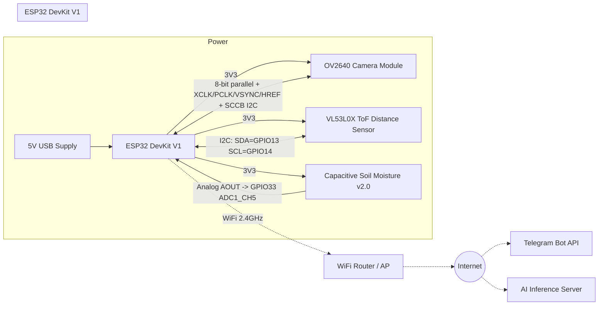

# Wiring Diagram

Smart Plant Guardian runs on a **single ESP32 DevKit V1**. The OV2640 camera
module, the VL53L0X distance sensor, and the capacitive soil moisture sensor
are all wired directly to it. See the main [README](../README.md#design-decisions)
for why this project does not use a separate AI-Thinker ESP32-CAM board.

> Double-check pin numbers against your specific DevKit V1 silkscreen before
> wiring — some clones label GPIOs slightly differently — and re-verify
> against `include/config.h` / `src/camera.cpp`, which are the source of
> truth the firmware actually compiles against.

## Block diagram

## Pin assignment table

| Signal              | ESP32 GPIO | Notes                                             |
|---------------------|-----------:|----------------------------------------------------|
| **Camera (OV2640)** |            | See `src/camera.cpp` for the `camera_config_t`     |
| PWDN                | 32         | Power-down control                                  |
| RESET               | -1         | Not wired; tie sensor RESET pin to 3V3              |
| XCLK                | 0          | Boot-strapping pin — camera clock only after boot   |
| SIOD (SDA, SCCB)     | 26         | Camera's own I2C bus, kept separate from VL53L0X    |
| SIOC (SCL, SCCB)     | 27         |                                                      |
| Y2..Y9 (D0..D7)      | 5,18,19,21,36,39,34,35 | 8-bit parallel data bus                |
| VSYNC               | 25         |                                                      |
| HREF                | 23         |                                                      |
| PCLK                | 22         |                                                      |
| **VL53L0X (I2C)**   |            |                                                      |
| SDA                 | 13         | Dedicated bus, does not share with camera SCCB      |
| SCL                 | 14         |                                                      |
| XSHUT               | 3V3 (tied high) | Always-on; firmware does not use shutdown pin  |
| **Soil Moisture v2.0** |         |                                                      |
| AOUT                | 33         | ADC1_CH5 — safe to sample with WiFi active          |
| VCC                 | 3V3        | Capacitive sensors tolerate continuous power; still recommend switching VCC through a MOSFET if long-term corrosion is a concern |
| GND                 | GND        |                                                      |
| **Status LED**      | 2          | Onboard LED on most DevKit V1 boards                 |

### Why these specific GPIOs

- GPIO34/35/36/39 are **input-only** on the ESP32 — perfect for the camera's
  `Y6..Y9` data lines, which are always ESP32-inbound.
- GPIO33 (ADC1_CH5) is deliberately left free for the soil sensor: ADC2 pins
  cannot be read reliably while WiFi is active, so every analog input in
  this design must live on ADC1 (GPIO32-39). GPIO32/34/35/36/39 are already
  claimed by the camera, leaving GPIO33 as the ADC1 pin of choice.
- The VL53L0X gets its own I2C bus on GPIO13/14 instead of sharing the
  camera's SCCB bus (GPIO26/27) or the ESP32's conventional default I2C
  pins (GPIO21/22, which the camera data bus already occupies here) — this
  avoids any bus-arbitration edge cases between two very different I2C
  peripherals.
- GPIO0 is a boot-strapping pin (must be low to enter flashing mode); it is
  only driven as XCLK after the bootloader has already released it, which
  is the same constraint every ESP32-CAM design already lives with.

## Power notes

- The camera module's peak current draw during capture can spike; power
  everything from a single well-regulated 5V/2A+ USB supply into the
  DevKit's 5V pin, not from the 3V3 regulator on a breadboard PSU module.
- Keep camera signal wires short (<10 cm) — the parallel data bus is not
  differential and is sensitive to noise/length at the XCLK frequency
  configured in `Config::CAMERA_XCLK_FREQ_HZ`.
